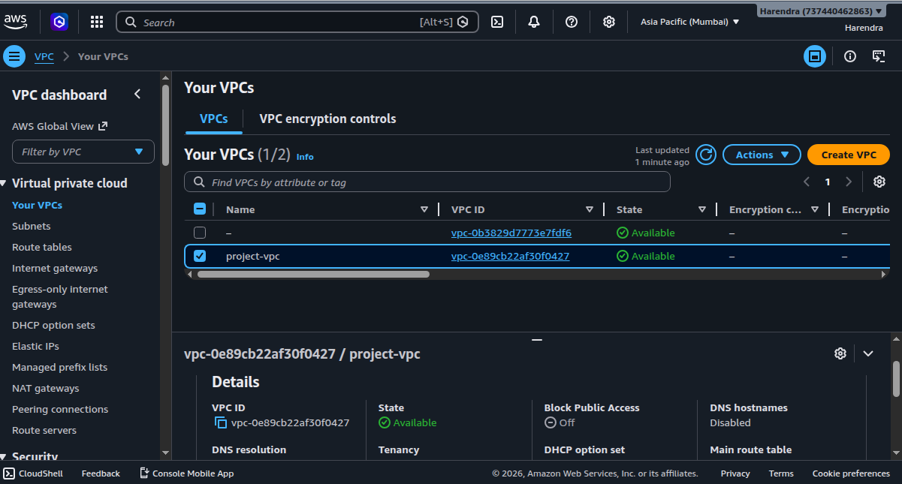
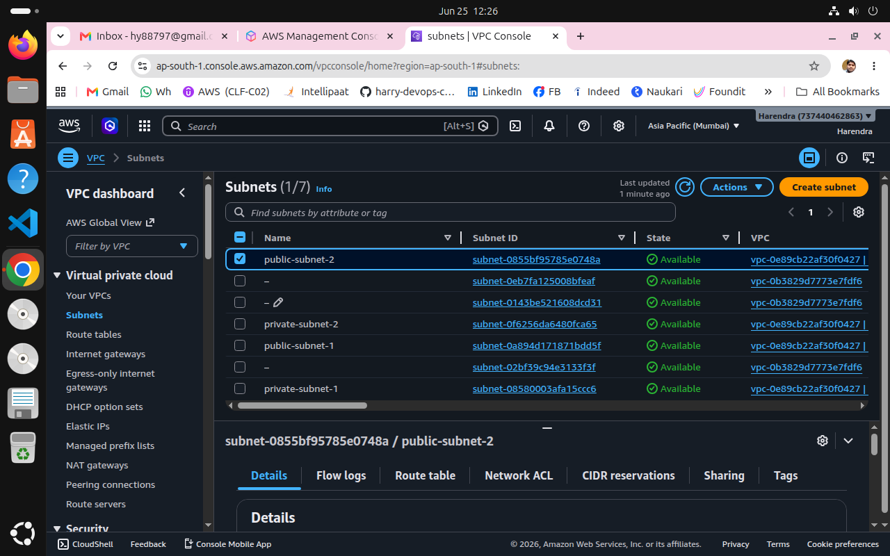
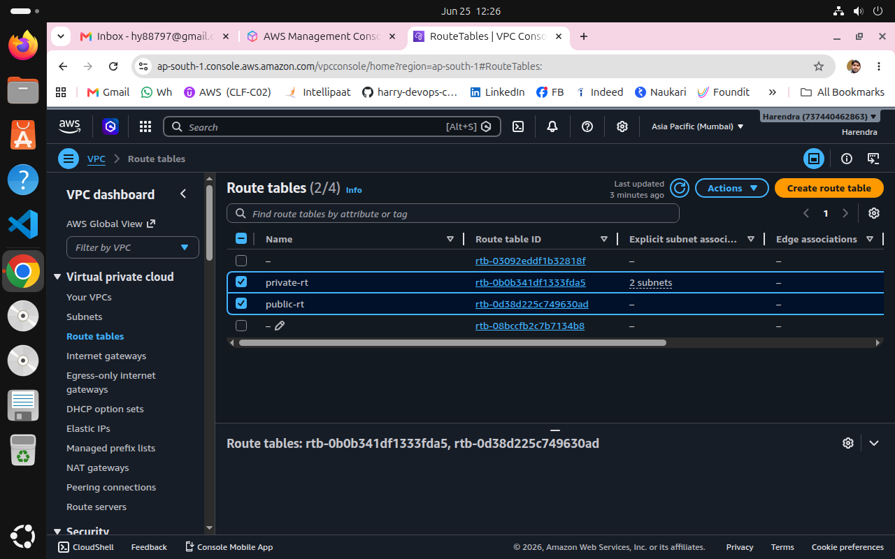
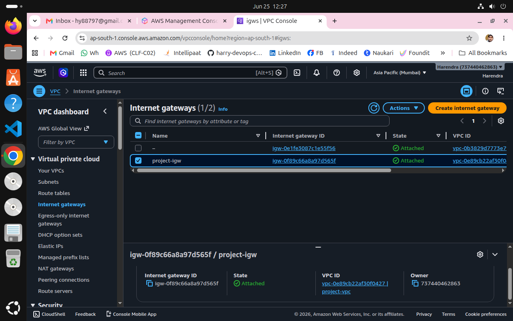
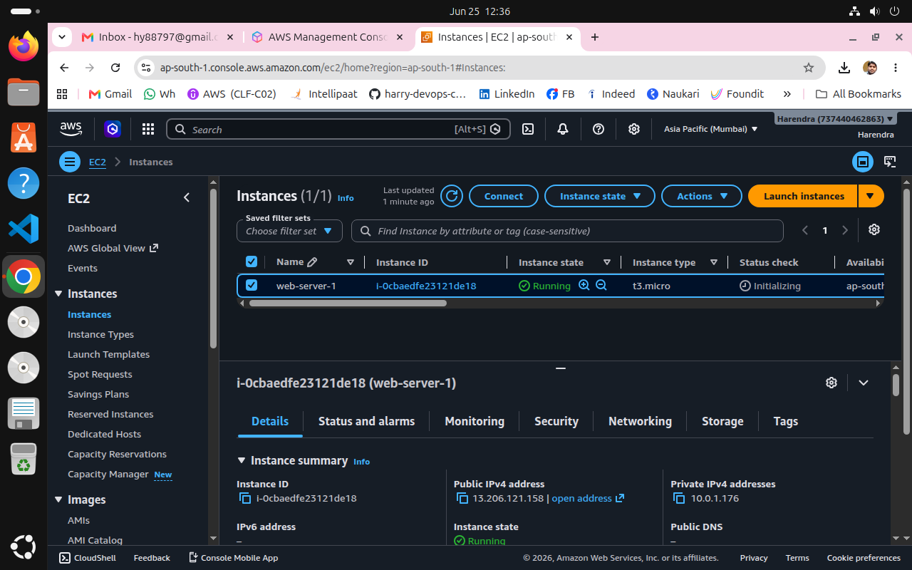
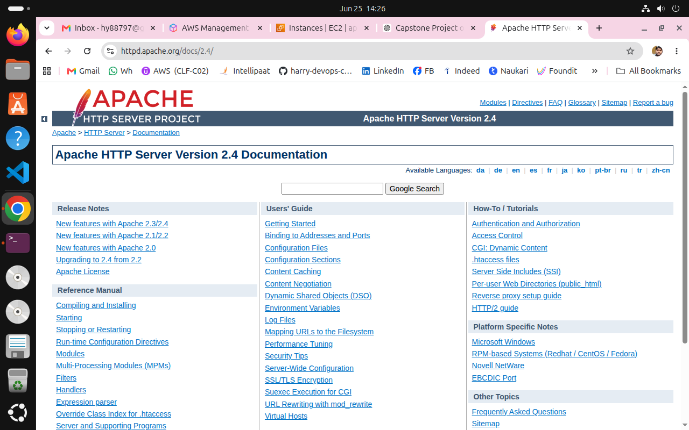
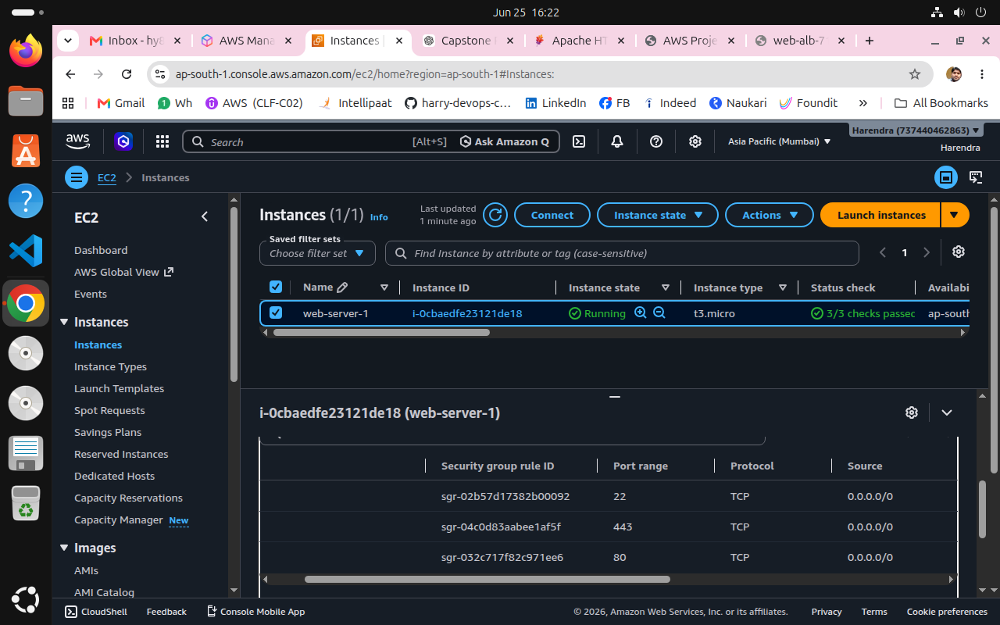
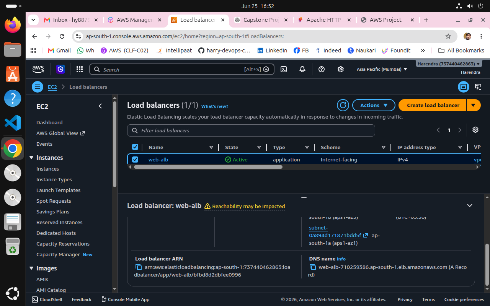
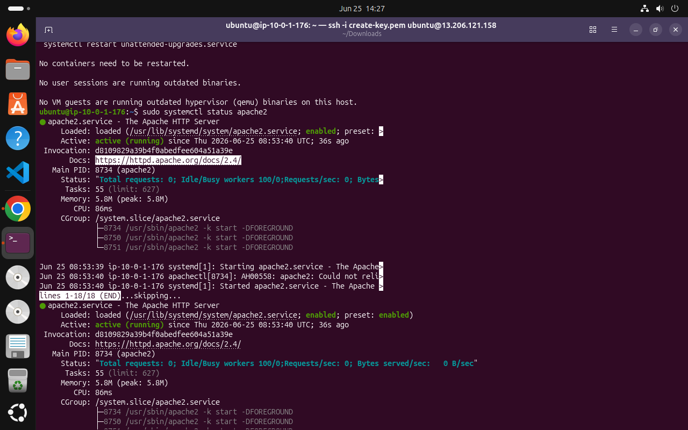
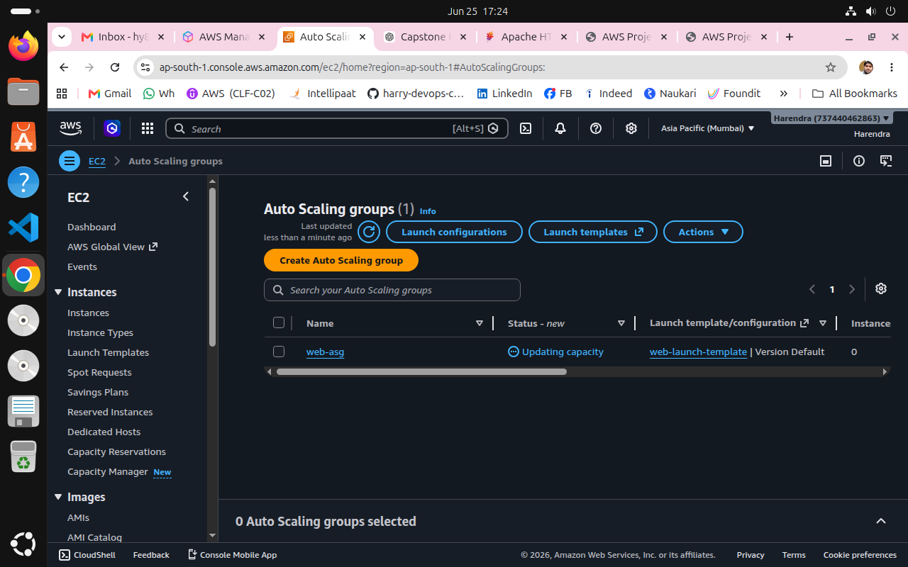

# AWS Highly Available Web Application Deployment

## Project Overview
This project demonstrates deployment of a highly available web application on AWS using:

- Amazon VPC
- Public Subnets
- Route Tables
- Internet Gateway
- EC2 Instance
- Apache Web Server
- AMI
- Launch Template
- Target Group
- Application Load Balancer (ALB)
- Auto Scaling Group (ASG)

The goal of this project is to build a scalable and fault-tolerant architecture.

---

## Architecture
User → Load Balancer → Target Group → EC2 Instances (Auto Scaling)

---

## AWS Services Used

### 1. VPC
Created custom VPC for isolated network.

### 2. Subnets
Created multiple public subnets in different availability zones.

### 3. Route Tables
Configured route tables for internet access.

### 4. Internet Gateway
Attached internet gateway to VPC.

### 5. EC2
Launched Ubuntu server.

### 6. Apache Web Server
Installed Apache and hosted sample website.

### 7. AMI
Created custom AMI from configured EC2.

### 8. Launch Template
Created launch template for Auto Scaling.

### 9. Target Group
Created target group for load balancer.

### 10. Application Load Balancer
Configured ALB for traffic distribution.

### 11. Auto Scaling Group
Configured ASG for high availability.

---

## Step-by-Step Implementation

### Step 1: Create VPC
Created custom VPC.

---

### Step 2: Create Subnets
Created public subnets.

---

### Step 3: Create Route Tables
Configured route table.

---

### Step 4: Attach Internet Gateway
Connected internet gateway.

---

### Step 5: Launch EC2
Created Ubuntu EC2 instance.

---

### Step 6: Install Apache
Installed Apache web server.

---

### Step 7: Deploy Website
Hosted sample web page.

---

### Step 8: Create AMI
Created machine image.

---

### Step 9: Create Launch Template
Launch template created.

---

### Step 10: Create Target Group
Target group configured.

---

### Step 11: Create Load Balancer
Configured ALB.

---

### Step 12: Configure Auto Scaling
Configured Auto Scaling Group.

---

## Challenges Faced

- Security group issue
- Route table association missing
- Load balancer health check issue

---

## Learning Outcomes

- AWS networking fundamentals
- EC2 deployment
- Apache hosting
- AMI creation
- Load balancing
- Auto scaling
- High availability architecture

---

## Final Result

Highly available web application deployed successfully using AWS infrastructure.

